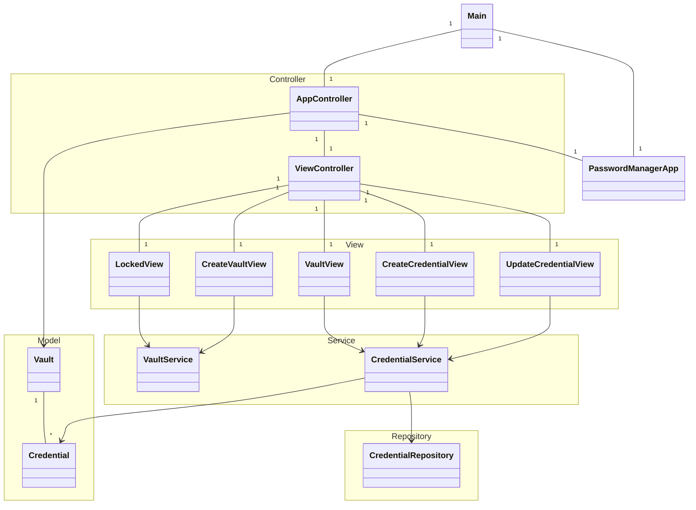
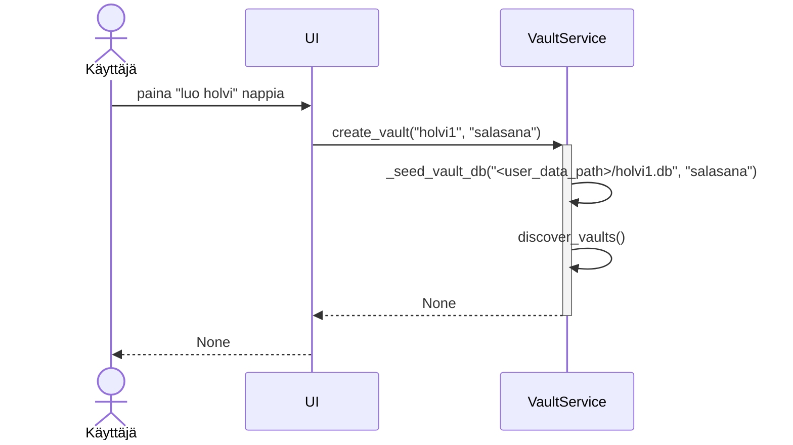
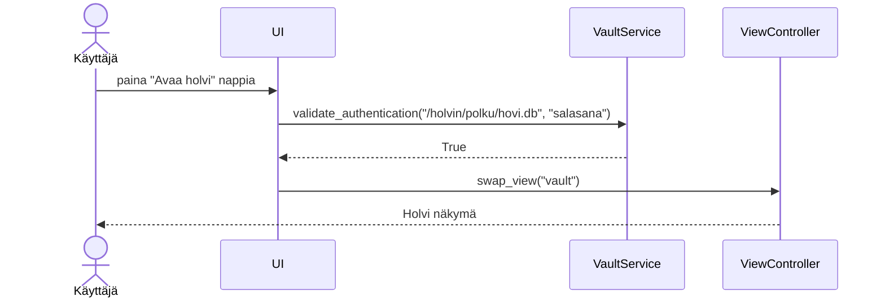
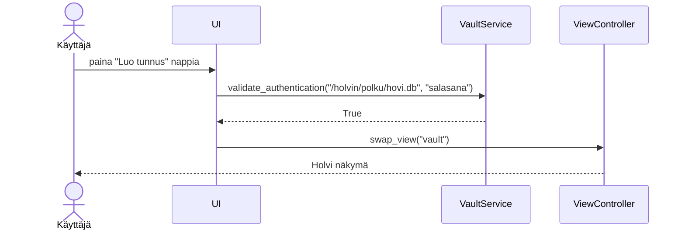

# Arkkitehtuuri

## Rakenne

Sovellus toteuttaa model view controller rakenteen ja repository rakenteen yhdistelmää.

## Käyttöliittymä

Sovellus sisältää 5 eri näkymää:
- Lukittu holvi
- Luo holvi
- Avoin holvi
- Luo tunnus
- Muokkaa tunnusta

Näkymiä ohjaa ViewController ajuri, jonka tehtävänä on tuhota edellinen näkymä ennen seuraavan näkymän näyttöä.

## Sovellus logiikka

Sovelluksen toiminta perustuu palveluihin, repositorioihin ja malleihin. Mallit ovat vain "tyhmiä" dataluokkia, joiden tarkoituksena on mallintaa tietoa järkevänä rakenteena. Palvelut puolestaan suorittavat erilaisia CRUD operaatioita mallien perusteella. Palvelut kutsuvat repositorioiden funktioita, jotta käyttäjän tekemät toimenpiteet tallentuvat tietokantoihin.

## Tietojen tallennus

Salasanaholvit tallennetaan käyttöjärjestelmästä riippuen eri tiedostopolkuun. Lähtokohtaisesti polku on käyttöjärjestelmän määrittelemä käyttäjän data kansio:
- Windows: `C:\Users\<username>\AppData\Local\password-manager\`
- Linux: `/home/<username>/.local/password-manager/`
- Mac: `/Users/<username>/Library/Application Support/password-manager/`

Jokainen holvi tallennetaan erillisenä sqlite tietokantana, jonka rivit ovat salattu AES algoritmilla.

## Päätoiminnallisuudet

### Uuden holvin luominen

Käyttäjä voi luoda uuden holvin painamalla vasemmassa alanurkassa näkyvää "+ Luo uusi holvi" nappia. Tämän jälkeen käyttäjältä kysytään uuden holvin nimi ja salasana, jolla holvi saadaan auki.

### Holvin avaaminen

Käyttäjä voi valita vasemmassa reunassa olevasta listasta holvin, jonka haluaa avata. Tämän jälkeen käyttäjältä kysytään salasana, jotta holvin salaus saadaan purettua.

### Tunnuksen lisääminen holviin
Käyttäjä voi lisätä uuden tunnuksen holviin painamalla "Luo uusi tunnus nappia" holvi näkymän vasemmassa alanurkassa. Tämän jälkeen aukeaa uusi näkymä jossa käyttäjä voi syöttää tunnuksen tiedot.

## Ongelmat sovelluksen rakenteessa
Credential luokka ottaa argumentiksi viittauksen Vault dataluokkaan. Kun Credential methodeja kutsutaan muokkaa se dataluokkaa paikallaan eikä palauta uutta erillistä instanssia. Mielestäni tämä rakenne voi olla hieman harhaanjohtava.