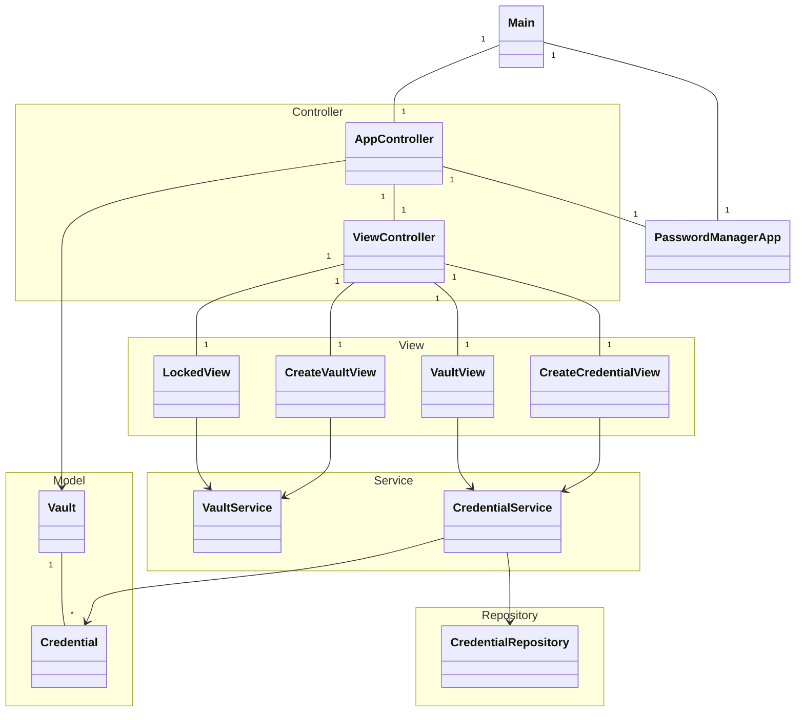

```mermaid
classDiagram

class Main
class PasswordManagerApp

namespace Controller {
    class AppController
    class ViewController
}

namespace Model {
    class Vault
    class Credential
}

namespace View {
    class VaultView
    class CreateCredentialView
    class LockedView
    class CreateVaultView
}

namespace Service {
    class VaultService
    class CredentialService
}

namespace Repository {
    class CredentialRepository
}

Main "1" -- "1" PasswordManagerApp
Main "1" -- "1" AppController
AppController "1" -- "1" PasswordManagerApp
AppController "1" -- "1" ViewController
ViewController "1" -- "1" VaultView
ViewController "1" -- "1" CreateCredentialView
ViewController "1" -- "1" LockedView
ViewController "1" -- "1" CreateVaultView
LockedView --> VaultService
CreateVaultView --> VaultService
VaultView --> CredentialService
CreateCredentialView --> CredentialService
CredentialService --> CredentialRepository
Vault "1" -- "*" Credential
CredentialService --> Credential
AppController --> Vault

```
