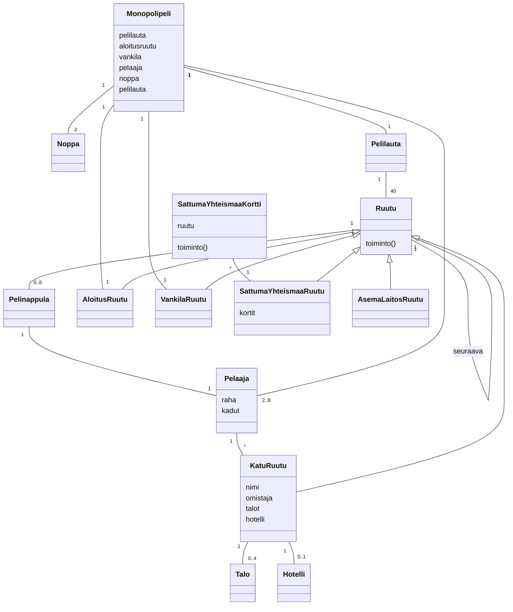

# Monopoli

```mermaid
 classDiagram
    Monopolipeli "1" -- "2" Noppa
    Monopolipeli "1" -- "1" Pelilauta
    Pelilauta "1" -- "40" Ruutu
    Ruutu "1" -- "1" Ruutu : seuraava
    Ruutu "1" -- "0..8" Pelinappula
    Pelinappula "1" -- "1" Pelaaja
    Pelaaja "2..8" -- "1" Monopolipeli
    Monopolipeli "1" -- "1" AloitusRuutu
    Monopolipeli "1" -- "1" VankilaRuutu
    Pelaaja "1" -- "*" KatuRuutu
    KatuRuutu "1" -- "0..4" Talo
    KatuRuutu "1" -- "0..1" Hotelli
    SattumaYhteismaaKortti "*" -- "1" SattumaYhteismaaRuutu

    Ruutu <|-- AloitusRuutu
    Ruutu <|-- VankilaRuutu
    Ruutu <|-- SattumaYhteismaaRuutu
    Ruutu <|-- AsemaLaitosRuutu
    Ruutu <|-- KatuRuutu

    class Monopolipeli {
        pelilauta
        aloitusruutu
        vankila
        pelaaja
        noppa
        pelilauta
    }

    class Pelaaja {
        raha
        kadut
    }

    class Ruutu {
        toiminto()
    }

    class AloitusRuutu

    class VankilaRuutu

    class SattumaYhteismaaRuutu {
        kortit
    }

    class SattumaYhteismaaKortti {
        ruutu
        toiminto()
    }

    class AsemaLaitosRuutu

    class KatuRuutu {
        nimi
        omistaja
        talot
        hotelli
    }

    class Talo
    class Hotelli

```
