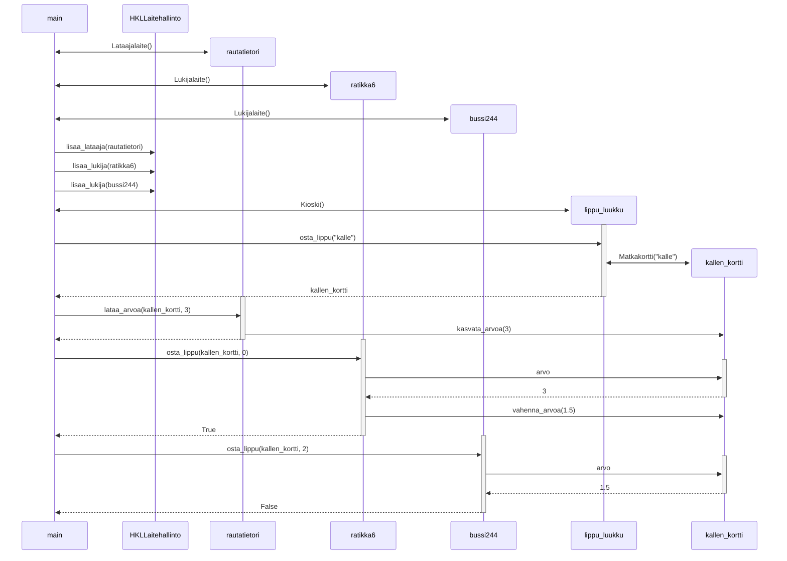

# Sekvenssikaavio

```mermaid
sequenceDiagram

participant main
participant HKLLaitehallinto 


create participant rautatietori
main <<->> rautatietori: Lataajalaite() 

create participant ratikka6
main <<->> ratikka6: Lukijalaite()

create participant bussi244
main <<->> bussi244: Lukijalaite()

main ->> HKLLaitehallinto: lisaa_lataaja(rautatietori)
main ->> HKLLaitehallinto: lisaa_lukija(ratikka6)
main ->> HKLLaitehallinto: lisaa_lukija(bussi244)

create participant lippu_luukku
main <<->> lippu_luukku: Kioski() 

activate lippu_luukku
    main ->> lippu_luukku: osta_lippu("kalle")
    create participant kallen_kortti
    lippu_luukku <<->> kallen_kortti: Matkakortti("kalle")
    lippu_luukku -->> main: kallen_kortti
deactivate lippu_luukku

activate rautatietori
    main ->> rautatietori: lataa_arvoa(kallen_kortti, 3)
    rautatietori ->> kallen_kortti: kasvata_arvoa(3)
    rautatietori -->> main : 
deactivate rautatietori

activate ratikka6
    main ->> ratikka6: osta_lippu(kallen_kortti, 0)

    activate kallen_kortti
        ratikka6 ->> kallen_kortti: arvo
        kallen_kortti -->> ratikka6: 3
    deactivate kallen_kortti

    ratikka6 ->> kallen_kortti: vahenna_arvoa(1.5)
    ratikka6 -->> main: True
deactivate ratikka6

activate bussi244
    main ->> bussi244: osta_lippu(kallen_kortti, 2)

    activate kallen_kortti
        bussi244 ->> kallen_kortti: arvo
        kallen_kortti -->> bussi244: 1.5
    deactivate kallen_kortti

    bussi244 -->> main: False
deactivate bussi244

```